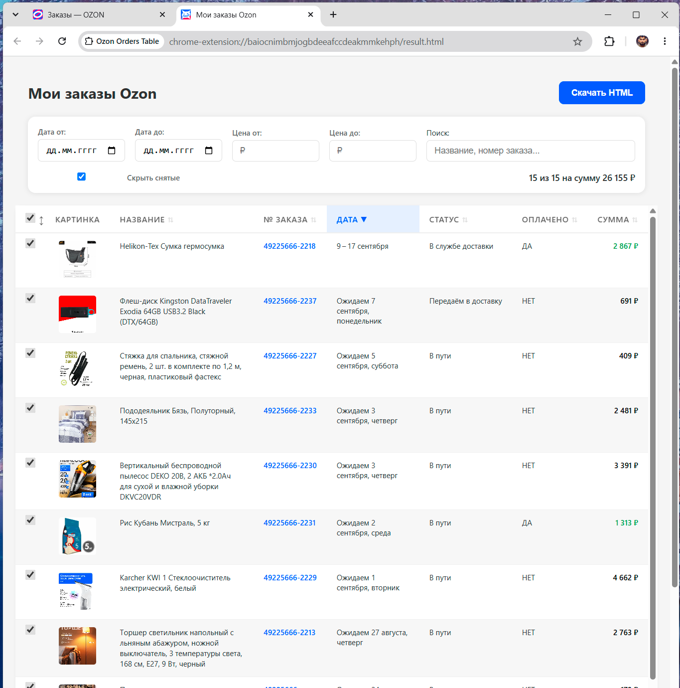

# Ozon Orders Tabs — Chrome-расширение

Расширение для Chrome, которое собирает и анализирует ваши заказы на Ozon со страниц электронных чеков и списка заказов.

## Возможности

- **Две поддерживаемые страницы:**
  - `ozon.ru/my/e-check*` — страница электронных чеков
  - `ozon.ru/my/orderlist/*` — страница списка заказов
- **Сбор данных:** картинка, название товара, номер заказа, дата, цена, статус доставки, информация об оплате
- **Автоматическая фильтрация** отменённых и полученных заказов (не попадают в таблицу)
- **Сортировка** по любой колонке: название, номер заказа, дата, статус, цена (повторный клик — обратный порядок)
- **Выборочный подсчёт суммы:** чекбокс в каждой строке включает/исключает позицию из суммы в шрифте; чекбокс в заголовке столбца включает или отключает сразу все позиции (в состоянии «все включены» — повторный клик снимает все галочки; при изменении отдельной строки заголовок переходит в серое/неопределённое состояние); кнопка `↕` в заголовке инвертирует все чекбоксы (включённые → выключенные и наоборот)
- **Фильтр «Скрыть снятые»:** чекбокс в панели фильтров скрывает строки с отключёнными чекбоксами из отображения
- **Навигация по картинкам клавиатурой** в полном просмотре: `←` / `→` перемещают между картинками позиций с активными чекбоксами; `Escape` закрывает; в подпись добавлен счётчик `N / M`
- **Улучшенный поиск** с поддержкой отрицания:
  - `книга` — покажет строки, содержащие «книга»
  - `!получен` — исключит строки, содержащие «получен»
  - `книга !получен` — строки со словом «книга», без слова «получен»
- **Фильтры** по диапазону дат, цен и чекбоксам («Скрыть снятые»)
- **Просмотр изображений** товаров в полном размере (модальное окно) с навигацией `←`/`→` по выбранным позициям
- **Экспорт** в автономный HTML-файл (работает без интернета)
- **Настройка лимита** собираемых заказов: выбор из выпадающего списка (10 / 20 / 50 / 100 / 500) или ввод произвольного числа вручную

## Установка

1. Откройте `chrome://extensions/`
2. В правом верхнем углу включите **Режим разработчика**
3. Нажмите **Загрузить распакованное расширение**
4. Выберите папку с проектом (где лежат `manifest.json`, `content.js`, `result.html` и др.)
5. Расширение появится в панели браузера

## Использование

### Страница электронных чеков

1. Перейдите на https://www.ozon.ru/my/e-check и войдите в аккаунт
2. На странице появится кнопка **«Построить таблицу»** — выберите лимит и нажмите
3. Расширение последовательно откроет карточки заказов, соберёт детали и сохранит их
4. Результат откроется в новом окне

### Страница списка заказов

1. Перейдите на https://www.ozon.ru/my/orderlist/ и войдите в аккаунт
2. На странице появится кнопка **«Построить таблицу»** — выберите лимит и нажмите
3. Расширение соберёт данные из видимой области страницы с автоматической прокруткой
4. Результат откроется в новом окне

### Работа с таблицей результатов

После сбора данных на странице результатов можно:

- Кликать по заголовкам колонок для сортировки
- Включать/исключать позиции из подсчёта суммы чекбоксами
- Инвертировать все чекбоксы кнопкой `↕` в заголовке столбца
- Скрыть позиции с отключёнными чекбоксами через фильтр «Скрыть снятые»
- Просматривать картинки в полном размере и листать `←`/`→` по выбранным позициям
- Вводить ключевые слова в строку поиска (поддерживается `!` для отрицания)
- Ограничивать диапазон дат и цен
- Нажать **«Скачать HTML»** для выгрузки отчёта

## Синтаксис поиска

Термины разделяются пробелами. Все совпадения нечувствительны к регистру.

| Запрос | Результат |
|---|---|
| `наушники` | Покажет строки, где есть «наушники» |
| `!отменён` | Спрячет строки со статусом «Отменён» |
| `чехол !заказано` | Покажет «чехол», но уберёт те, что ещё не получены |

## Данные и структура

- Данные сохраняются в `chrome.storage.local` под ключом `ozonOrders`
- Плоская структура: 1 товар = 1 строка таблицы (один заказ с 3 товарами = 3 строки)
- Даты парсятся из русского формата с учётом неразрывных пробелов (`\u00A0`):
  - Эчеки: `16 августа 2026 в 02:03`
  - Список заказов: `Ожидаем 16 августа`, `9 – 17 сентября`

## Файлы проекта

| Файл | Назначение |
|---|---|
| `manifest.json` | Манифест расширения (Manifest V3) |
| `background.js` | Service Worker, открытие окна результатов |
| `content.js` | Инъекция UI на Ozon, определение типа страницы, парсинг e-check и orderlist |
| `content.css` | Стили кнопки сбора на странице Ozon |
| `result.html` | Разметка и стили страницы с таблицей результатов |
| `result.js` | Логика таблицы: парсинг дат, фильтрация, сортировка, экспорт, модальные окна |

## Примечания

- Требуется активная сессия Ozon в браузере
- Сбор данных выполняется последовательно с паузами, чтобы не перегружать серверы
- При изменении структуры страниц Ozon селекторы в `content.js` могут потребовать обновления
